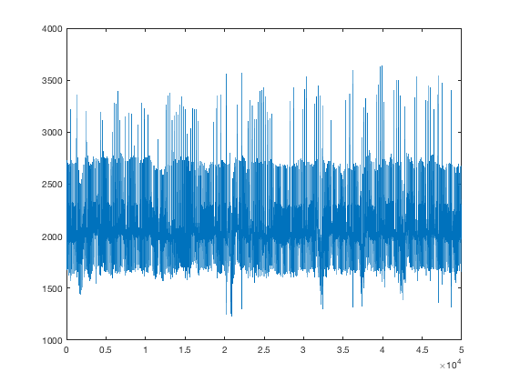
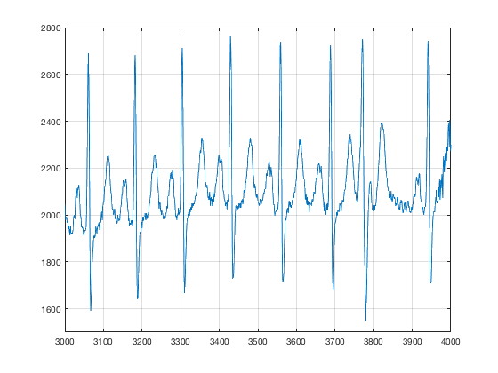
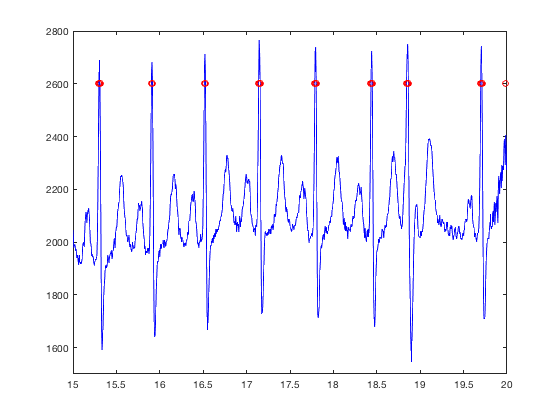
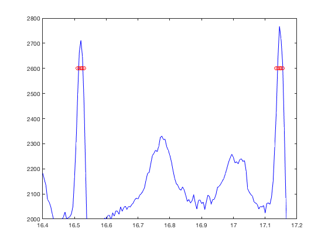
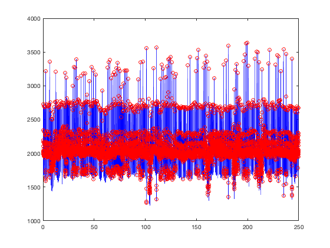
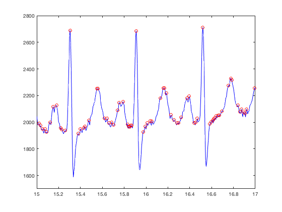
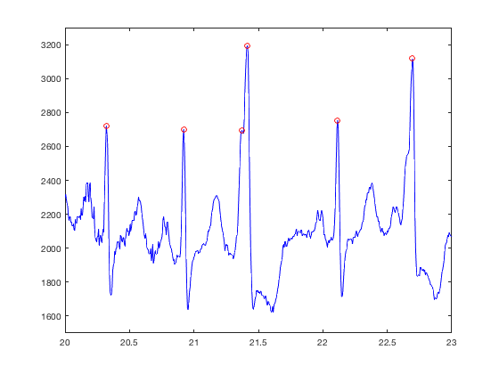
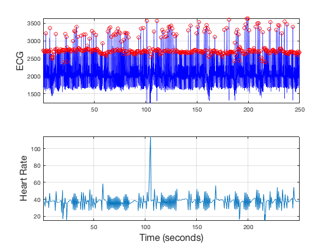

<h1>Visualisation and analysis of an Electrocardiogram Signal</h1><!--introduction-->

This exercise will take you step by step in the process of reading, displaying and analysing in a simple way a signal of an Electrocardiogram.
<!--/introduction-->

The first step is to read the file that contains the electrocardiogram, this can be done with the command 'load' like this:

<pre class="codeinput">load Electrocardiogram
</pre>

This file contains 250 seconds of an ECG recording, since the sampling rate is 200 Hz, the file contains 50,000 samples.  We can now display the ecg in time with the command plot:

<pre class="codeinput">plot(ecg)
</pre>

This data signal has been read from the website of Professor Rangaraj M. Rangayyan (<a href="http://people.ucalgary.ca/~ranga/">http://people.ucalgary.ca/~ranga/</a>). If you follow the section "Lecture notes, lab exercises, and signal data files" you will find a large number of signals from different acquisition modalities (ECG, EEG, EMF, etc.). You can save the files from a browser to your hard drive and then open with the command load as above. You can also read the data sets directly from Matlab. The following lines will show you how to do this.

First, you need to know the whole address where the file is located, then you use the command 'urlread'.

<pre class="codeinput">file = 'http://people.ucalgary.ca/~ranga/enel563/SIGNAL_DATA_FILES/ecgpvc.dat';

ecg_string  = urlread(file);
</pre>

You should notice that the command 'urlread' has provided a variable of a different data type from the file we read previously. We can list the variables and their characteristics with the command 'whos'

<pre class="codeinput">whos
</pre>
<pre class="codeoutput">  Name                Size                  Bytes  Class      Attributes

  ecg             50000x1                  400000  double               
  ecg2            50000x1                  400000  double               
  ecg_string          1x850000            1700000  char                 
  file                1x69                    138  char                 
  peaks_1         50000x1                   50000  logical              
  peaks_2           403x1                    3224  double               
  pos_peaks         403x1                    3224  double               
  time                1x50000              400000  double               

</pre>

Since the file was read from a website, it was assumed that it would be a string of characters, therefore we need to convert those characters to a number. This is quite easy, with the command 'str2num'.

<pre class="codeinput">ecg         = str2num(ecg_string);
plot(ecg)
</pre>

We have now read the file directly from the website. Try reading and displaying other files.

As it is evident from the graph, the number of samples can make it difficult to observe the detail of each heart cycle. We can zoom in manually with the magnifying glass of the figure, and also from the command line with the command axis, like this:

<pre class="codeinput">axis ([3000 4000 1500 2800])
grid on
</pre>

One interesting and simple exercise with this signal is to detect the peaks of each cycle. A simple attempt would be to detect regions of the signal that exceed a certain value. For instance, we can set a threshold (arbitrarily) at 2400, and generate a new signal from the comparison of the ecg against the threshold:

<pre class="codeinput">peaks_1 = ecg&gt;2400;
</pre>

At the same time, we can create a signal that corresponds to the time, this will be useful later on:

<pre class="codeinput">time = (1:numel(ecg))/200;
</pre>

We can now compare the two signals, the original and the thresholded by plotting them together. Since the thresholded signal will have values between 0 and 1, we need to scale it in order to have the two signals in the same ranges. We can do that inside the plot command like this:

<pre class="codeinput">plot(time,ecg,'b',time,2600*(peaks_1),'ro')
axis ([15 20 1500 2800])
</pre>

Notice that since we are now using time, the axis instruction has changed. If we look closely we can spot a problem:

<pre class="codeinput">axis ([16.4 17.2 2000 2800])
</pre>

The threshold is providing with a value for every single place where the signal exceed the given value, which is not exactly the same as detecting a peak. Fortunately Matlab has a function (always check to see if Matlab has a function for what you want, among thousands of pre-programmed functions, it is very likely that Matlab will simplify your work) to detect peaks called 'findpeaks', which is used like this:

<pre class="codeinput">[peaks_2,pos_peaks] = findpeaks(ecg);
</pre>

We have now two vectors, one with the actual value of the peaks and a second with the location. Again, the best thing is to visualise the results:

<pre class="codeinput">plot(time,ecg,'b',pos_peaks/200,(peaks_2),'ro')
</pre>

Notice two important things. First, since the positions are located from a vector, these have to be normalised with respect to time by dividing them by the sampling rate (200 Hz). Second, there seems to be an awful large number of "peaks" where there should not be any peaks, let's zoom in:

<pre class="codeinput">axis ([15 17 1500 2800])
</pre>

This is a good example of the specific nature of some processing techniques. The finding of peaks is detecting ANY point which is higher than its neighbours, which is of course different of what we are trying to detect, which in turn leads to the question, which "peaks" are the ones we want?

OK let's be specific, we want relatively big peaks (not those that are most probably due to noise) and the ones that are sharp and high, which should be closely related to the heart rate. That can be translated into rules like these: peaks that (a) are above a certain level (again 2400 can be a good threshold), (b) are not too close to each other. The second rule may not be immediately clear so let's take one at a time. First, let's discard all peaks that are below the threshold and display:

<pre class="codeinput">[peaks_2,pos_peaks] = findpeaks(ecg,'MINPEAKHEIGHT',2400);

plot(time,ecg,'b',pos_peaks/200,(peaks_2),'ro')
axis ([20 23 1500 3300])
</pre>

We can now see how the second rule will impact, as there are two positions detected within one single "peak". Let's repeat and find only those peaks that are at least 10 positions away from each other

<pre class="codeinput">[peaks_2,pos_peaks] = findpeaks(ecg,'MINPEAKDISTANCE',10,'MINPEAKHEIGHT',2400);

plot(time,ecg,'b',pos_peaks/200,(peaks_2),'ro')
axis ([20 23 1500 3300])
</pre>

As a final step, we can display the ECG, and below it, the time differences between the peaks, that is, we can see the heart rate as inferred from these peaks. We can display two signals in a single figure with the command 'subplot' like this:

<pre class="codeinput">subplot(211)
plot(time,ecg,'b',pos_peaks/200,(peaks_2),'ro')
grid on
axis tight

ylabel ('ECG','fontsize',16)
subplot(212)
plot(time(pos_peaks(2:end)), 60*diff(pos_peaks/200));axis tight
grid on
axis tight
ylabel ('Heart Rate','fontsize',16)
xlabel ('Time (seconds)','fontsize',16)
</pre>

Finally we have displayed the heart rate as extracted from the ECG. Notice that the heart rate is relatively stable around 40 b.p.m. rather below the average of 60 b.p.m. There is one sudden peak around 100, this is most likely due to an error in the processing. Can you see why this happens? Can you think how to fix this?

Try reading other signals and doing simple step-by-step analysis.

